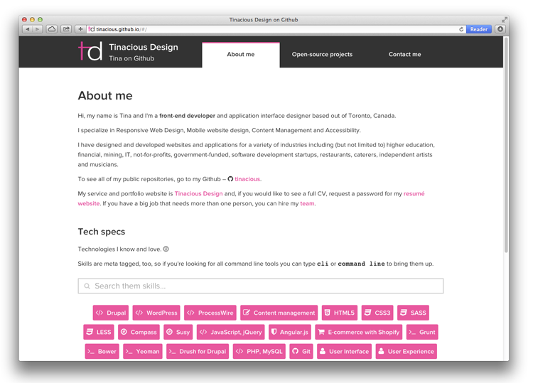

# Tinacious Github page

This is my Github username page. 

It was built in Angular.js and uses the Github REST API to access my repositories.

Yeoman was used for scaffolding, Grunt for task running, and Bower for managing dependencies.

Read about it on my [blog](http://tinaciousdesign.com/blog/2014/01/github-user-page-in-angular-js/ ‎).

